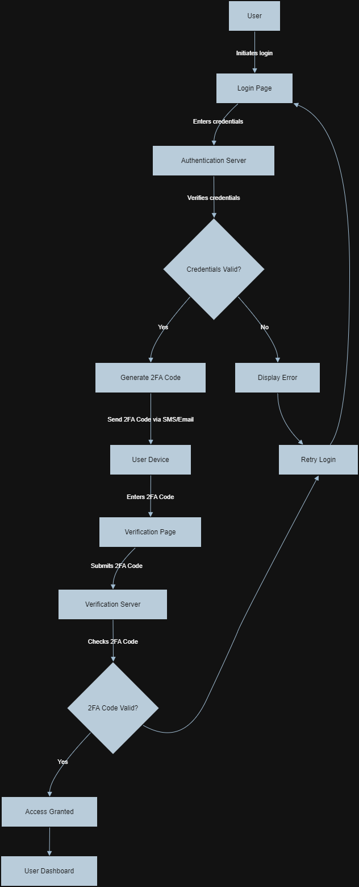

# 2 Factor Authentication (2FA) in PHP

Example of 2 Factor Authentication in PHP

This repository contains a small project to see how the 2FA works.

To run this project, you must have created a bot on Telegram. Telegram allows you to send messages for free for two-factor authentication.

Here you can see a diagram of how the connection flow works in this system.

## ScreenShots

### Login screen

### One time password screen

## About the script

The script works as follows. The user authenticates with their email and password. If the credentials are correct, the system sends a message to the user's cell phone with a 6-digit code. The user has 2 minutes to enter that code on the OPT screen. If the code is correct, the system will redirect the user to their dashboard.

For this script to work correctly, you must have a Telegram account with an active bot.

This system can be implemented with other systems for sending the 6-digit code, such as email, SMS, etc.

You can download the project and run it on a web server such as Apache with PHP 8.2

Open a browser and open the main app with this url: http://127.0.0.1

And that's all!

Developed by Luis L.T.
